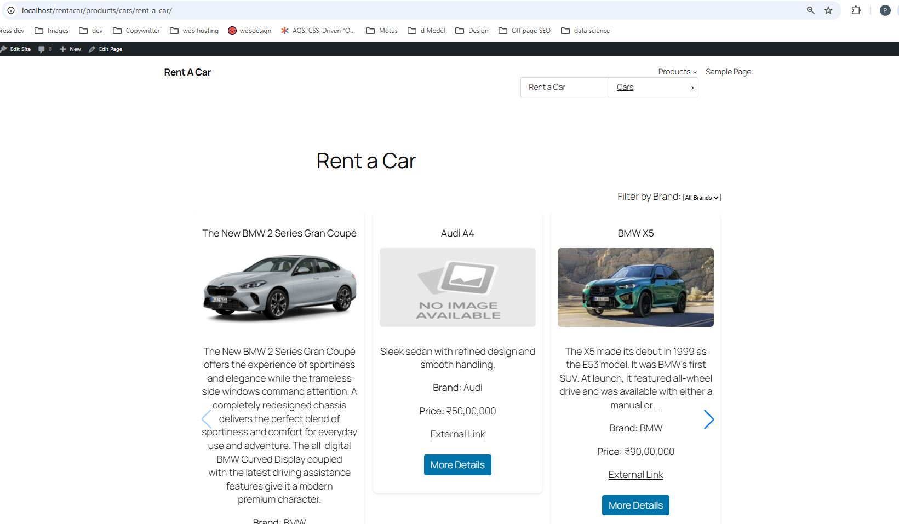
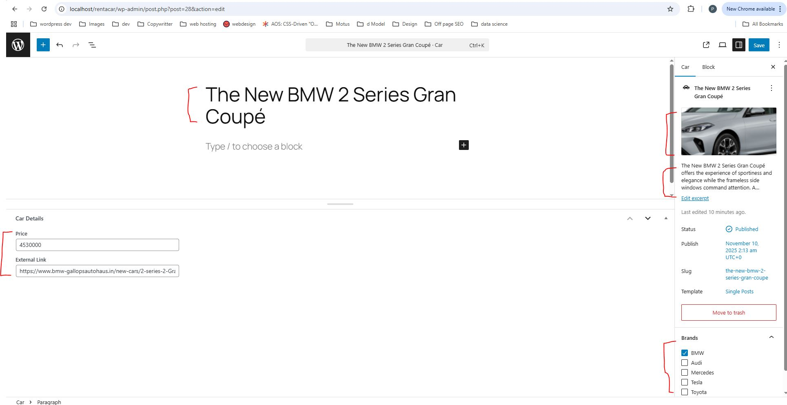
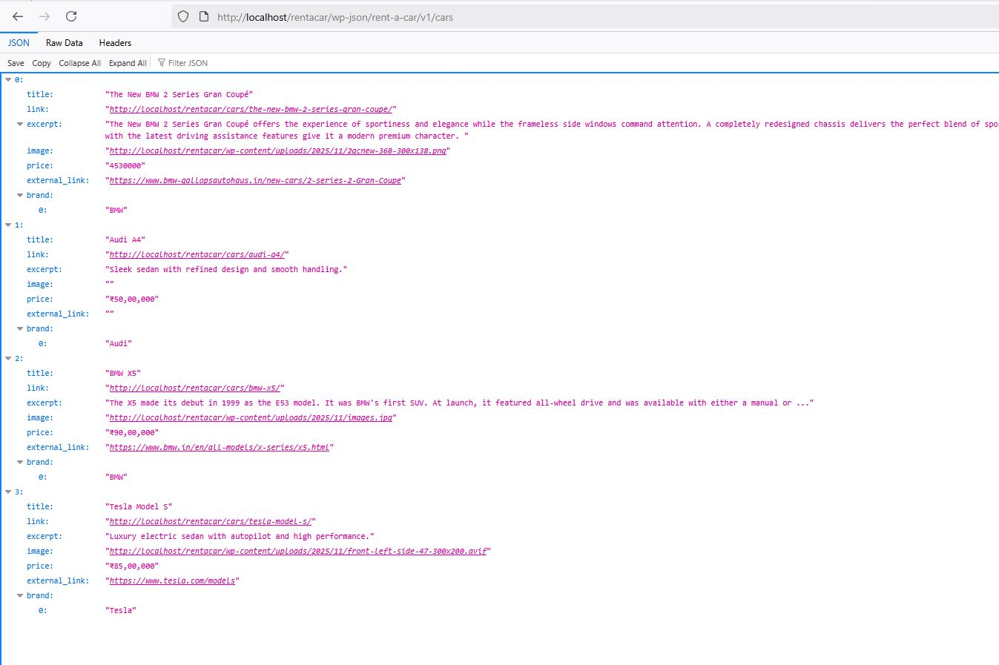

# Rent a Car – WordPress Website

A complete **WordPress-based car rental website** developed as part of a technical test.  
It includes a custom-built plugin — **Rent a Car** — that manages car listings, brands, and pricing using WordPress’s native extensibility.

---

## Features

### Core Functionality
- **Custom Post Type:** `Cars`
- **Custom Taxonomy:** `Brand`
- **Meta Fields:** Price, External Link
- **REST API Endpoint:** `/wp-json/rent-a-car/v1/cars`
- **Brand Filter:** Dynamic dropdown powered by AJAX
- **Responsive Slider:** Built using **Swiper.js**
- **Auto Page Creation:** `/products/cars/rent-a-car/`
- **Shortcode:** `[rent_a_car_slider]`
- **Graceful Timeout & Retry:** For API requests

---

## Tech Stack

| Component | Technology |
|------------|-------------|
| CMS | **WordPress 6.8.3** |
| Server Language | **PHP 8.x** |
| Frontend | **JavaScript (ES6)** |
| Slider Library | **Swiper.js** |
| Markup & Style | **HTML5, CSS3** |
| Local Dev | **XAMPP** |

---

## Plugin: Rent a Car

The **Rent a Car** plugin is the heart of this project.  
It allows administrators to manage car listings with associated brands, prices, and details — and display them dynamically via a REST-powered slider.

### REST API Example
```bash
GET /wp-json/rent-a-car/v1/cars
GET /wp-json/rent-a-car/v1/cars?brand=BMW
```

### Shortcode
```php
[rent_a_car_slider]
```

---

## Screenshots

**1. Frontend – Rent a Car Slider with Brand Filter**  


**2. Admin – Cars Custom Post Type**  


**3. REST API Response Example**  


---

## Folder Structure

```
wordpress/
├── wp-admin/
├── wp-content/
│   ├── plugins/
│   │   └── rent-a-car/
│   │       ├── includes/
│   │       ├── public/
│   │       ├── admin/
│   │       └── readme.txt
│   └── themes/
└── README.md
```

---

## Installation

1. Clone or copy the project into your local `htdocs` directory.
2. Import your WordPress database and configure `wp-config.php`.
3. Activate the **Rent a Car** plugin from **Plugins → Installed Plugins**.
4. Visit `/products/cars/rent-a-car/` to see the live car slider.

---

## Developer

**Developed by:** [Pinakpani Joshi](mailto:joshipinakpani@gmail.com)  
**GitHub:** [github.com/pinakpani](https://github.com/pinakpani)  

---

## License

This project is licensed under the [GPLv2 or later](http://www.gnu.org/licenses/gpl-2.0.html).

---

## Summary

| Feature | Description | Status |
|----------|--------------|--------|
| Car Listings | Manage via custom post type | ✅ |
| Brand Filter | AJAX brand dropdown | ✅ |
| REST API | `/wp-json/rent-a-car/v1/cars` | ✅ |
| Slider | Swiper.js integration | ✅ |
| Shortcode | `[rent_a_car_slider]` | ✅ |
| Meta Fields | Price, external link | ✅ |
| Auto Page | `/products/cars/rent-a-car/` | ✅ |

---

> _“A WordPress plugin for car rental listings.”_
